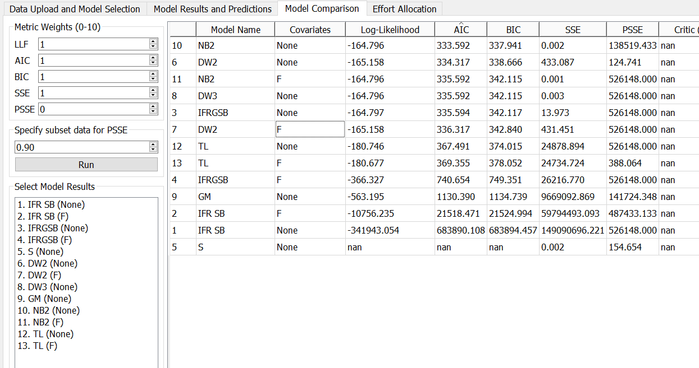
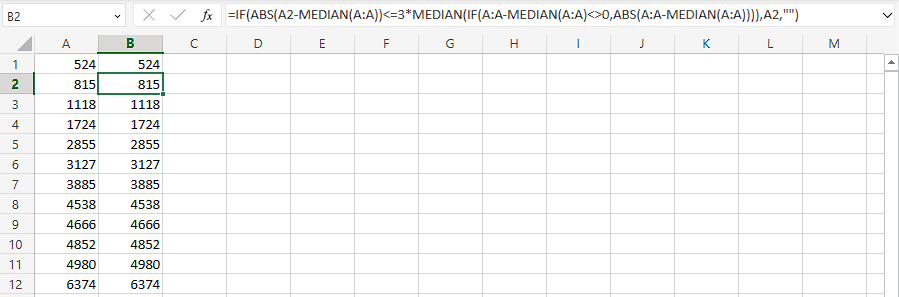
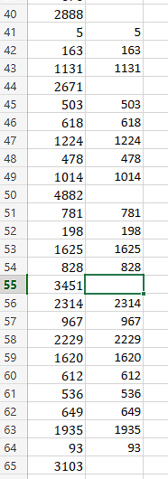

**SENG 438- Software Testing, Reliability, and Quality**

**Lab. Report \#5 – Software Reliability Assessment**

| Group \#: 25    |     |
| --------------- | --- |
| Student Names:  |     |
| Chun-chun Huang |     |
| Amneet Deol     |     |
| Hiten Mahalwar  | 10187026 |
| Shreosi Debnath  30111867|

# Introduction

In this lab our group will be analyzing the results of various integration test datasets using reliability assessment tools like C-SFRAT, SRTAT, and an manual-RDC excel spreadsheet.
Using these tools we were able to measure failure rate, mean-time-to-failure (MTTF), and the general reliability of the SUT. The first part of this report states our findings in Reliability growth testing which was conducted using SRTAT on Failure Set 3.
The second part of the report will discuss our findings from the Reliability Demonstration Chart (RDC) which we conducted using the provided excel sheet.

#

# Assessment Using Reliability Growth Testing

the model which align better with our failure data have the highest Log-likelyhood and lowest AIC and BIC. According to the snapshot above, the two best-fit models are Negative Binomial Order 2 (NB2)and Discrete Weibull Order 2 (DW2) at the top of the model comparison list.

- column B display all the data which pass laplace data test. The snapshot above also shows the formula for the lapace test.

- After apply the laplace formula, we can see entry 40,44,50,55,65 in the failure report 2 which these data entries do not pass the laplace test. Therefore, we are not using them.

- after discarding some invalid data, we end up with MTTF 783.7167. Target failure rate is just 1 over 783.7167, so it is 0.001276

# Assessment Using Reliability Demonstration Chart
 
We used the failure data from  Failure Report 3. Through trial and error we found the MTTF to be 500 (we understood this to be the minimum number of events for it to reach the acceptable region on the RDC graph). 

The Reliability Demonstration Chart (MTTF = 500):

This graph shows that the data starts in the continued testing region and enters the acceptable region. 

The Reliability Demonstration Chart with Double MTTF (MTTF = 1000):

This graph shows that the data stays in the yellow region, so more testing would have to be done as it is inconclusive. 

The Reliability Demonstration Chart with Halved MTTF (MTTF = 250):

This graph shows that the data enters the acceptable region; however, the start of the data appears to be in the acceptable region as well, so perhaps continued testing would still need to be done.

#Advantages and Disadvantages of RDC
Advantages:
- more user friendly and intuitive --> it was much more simple to analyze the MTTF and when it crossed into the acceptable range. 
- requires less input data (just the failure data)
- easier to predict trends
- a quick way to visualize failure data

Disadvantages:
- the MTTF is at the user's discretion (may not be as precise)
- there is not data for reliability (numerical), which is quite important 

# Comparison of Results

# Discussion on Similarity and Differences of the Two Techniques

Reliability Growth Testing (RGT) and Reliability Demonstration Chart (RDC) are two methods used to ensure the reliability of a product. While both are designed to test the product's reliability, they differ in their objectives, testing approach, sample size, timing, and cost.

The objective of RGT is to identify and eliminate failure modes in the product during its development phase, whereas RDC aims to demonstrate that the product meets required reliability specifications before it's released to the customer. RGT involves continuous testing and analysis to find and fix problems, while RDC is a one-time test that checks if the product meets reliability standards.

In terms of testing approach, RGT requires a larger sample size and continuous testing to detect and correct failures throughout the development phase, while RDC involves testing a fixed number of units for a set period of time to demonstrate the product's reliability.

Timing is another significant difference between the two methods. RGT is conducted during the development phase of the product, while RDC is done after the product has been developed and is ready for release. The difference in timing allows RGT to identify and fix any problems early in the development process, while RDC checks if the product meets the required reliability standards before it's released to the customer.

Finally, cost is another factor that sets these two methods apart. RGT is more expensive than RDC because it requires continuous testing and analysis, while RDC is a one-time test and is therefore less expensive.

In summary, both RGT and RDC are important methods used to ensure product reliability. RGT helps to improve the product's reliability during its development phase by continuously testing and fixing any issues, while RDC checks if the product meets the required reliability standards before it's released to the customer.

# How the team work/effort was divided and managed

To split the lab up, some members of our team worked on part 1 (those with windows computers) and the others worked on part 2 with the rdc and excel analysis. Overall, the team worked well together to complete the lab and the work was split evenly. We met in the lab to work and ask questions and communicated efficiently outside of the lab time to complete the final report.  

# Difficulties encountered, challenges overcome, and lessons learned

We encountered a lot of problems with running the software. Though we had a general understanding of what needed to be done, it was unclear and a bit confusing when it came down to working on the lab. As well, some of the software did not work with mac os, so we had to work around that (splitting up the workload with the other parts of the lab).

# Comments/feedback on the lab itself
Overall, we thought the lab was interesting, but we had a lot of issues in the beginning with the setup. In the future, more detailed instructions would be appreciated to better understand how to use the software. It took us a while to figure out how to exactly how to run everything properly. 
